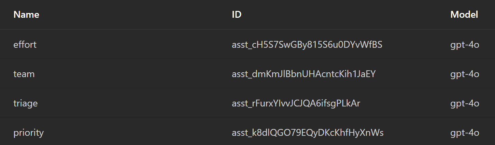
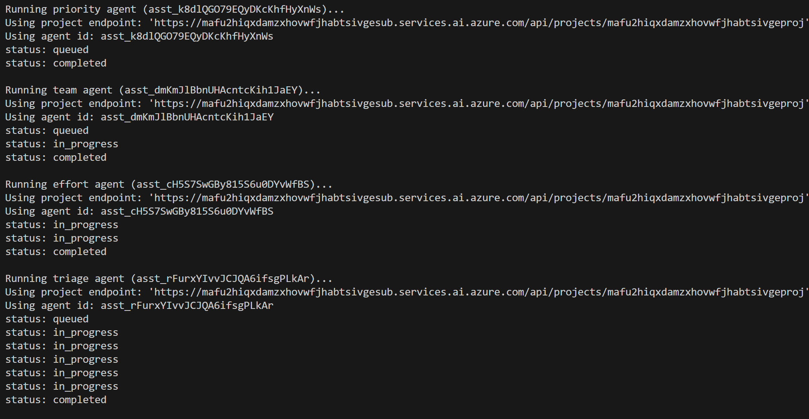
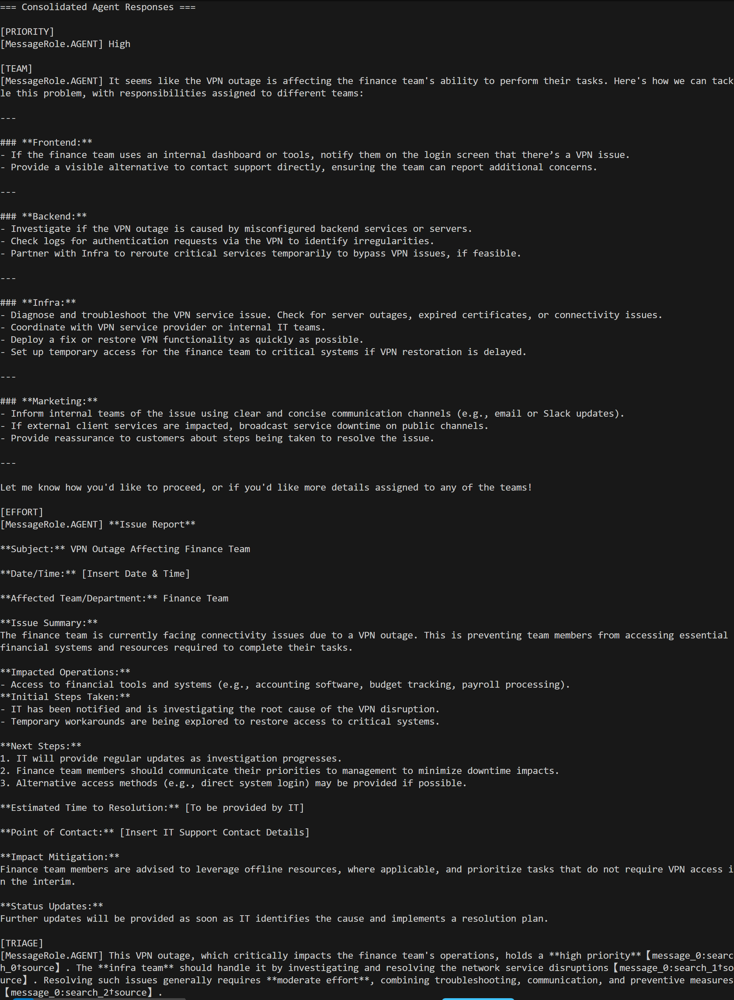
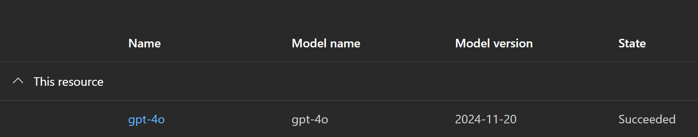

# Multi-Agent Demo Guide

This guide walks through a live demo that deploys the Azure AI multi-agent triage solution, boots the specialist agents, and verifies their outputs in a single run.

---

## Demo Objectives

1. Provision the full infrastructure stack (Container App, Azure AI Foundry project, GPT-4o deployment, Container Registry).
2. Bootstrap the four agents (priority, team, effort, triage) and store their IDs in the environment.
3. Test each agent individually as well as the orchestrating triage flow.
4. Highlight the Azure portal resources and agent responses using the prepared screenshots.

---

## 1. Deploy the Solution with `azd`

### Command

```pwsh
azd up
```

### Narrative

- Explain that `azd up` uses the Bicep templates under `infra/` to build the entire environment:
  - Azure Container Apps environment and container app hosting the FastAPI API.
  - Azure Container Registry for the API image.
  - Azure AI Foundry project with GPT-4o deployment and project connection.
- Point out the generated `.azure/<env>/.env` file containing outputs (project endpoint, agent IDs placeholder, container app URL).
- Mention the `azure.yaml` metadata that identifies the service and infrastructure paths.

### Screenshot Reference: `azd-multiagent-resource-group.png`


Use this image to show the deployed resource group in the Azure portal. Highlight the following resources exactly as they appear in the screenshot:

1. **`mafu2hiqxdamzxho-env`** – Azure Container Apps environment hosting the workload.
2. **`mafu2hiqxdamzxho-api`** – Azure Container App running the FastAPI triage service.
3. **`mafu2hiqxdamzxhoacr`** – Azure Container Registry storing the API container image.
4. **`mafu2hiqxdamzxhovwfjhabtsivgeaif` (Azure AI Foundry account)** – the service that owns the GPT-4o deployment.
5. **`mafu2hiqxdamzxhovwfjhabtsivgeproj` (Azure AI Foundry project)** – the project object used by the agents.
6. **`log-mafu2hiqxdamzxho` Log Analytics workspace** – diagnostics for Container Apps.
7. **`dce-mafu2hiqxdamzxho` / `dcr-mafu2hiqxdamzxho` data collection endpoint & rule** – ingest pipeline for Container Apps logs.
8. **`appinsights-mafu2hiqxdamzxho` Application Insights** – telemetry for the API container.
9. **Managed identity resources** (for example, `userAssignedIdentity-mafu2hiqxdamzxho`) – identities granted access to the AI project.
10. **Supporting infrastructure** (such as the virtual network or storage account provisioned by Container Apps) – point out any additional entries visible in the screenshot.

Note: The exact resource names use the deterministic suffix generated during deployment; align them with what appears in the image.

---

## 2. Bootstrap the Agents

### Command

```pwsh
python scripts/bootstrap_agents.py
```

### Narrative

- Emphasize that the script waits for DNS propagation of the Azure AI Foundry endpoint before creating agents.
- It creates three specialist agents and one triage agent, all targeting the GPT-4o deployment (`modelSkuCapacity` defaults to 2).
- The script prints each agent ID and runs `azd env set` to persist them:
  - `PRIORITY_AGENT_ID`
  - `TEAM_AGENT_ID`
  - `EFFORT_AGENT_ID`
  - `TRIAGE_AGENT_ID`
- These values are stored in `.azure/<env>/.env`, which the other scripts consume.

### Screenshot Reference: `azd-multiagent-agents-in-ai-foundry.png`



- Show the Azure AI Foundry portal listing the four agents (priority, team, effort, triage).
- Highlight that the agent names match the ones created by the script.
- Mention that the screenshot reinforces the automatic provisioning step versus manual creation.

---

## 3. Test Agents Individually (Optional)

### Command

```pwsh
python scripts/verify_agent.py \
  --agent-id $Env:TRIAGE_AGENT_ID \
  --ticket "VPN outage affecting finance team" \
  --max-attempts 12 \
  --initial-backoff 12 \
  --max-backoff 60 \
  --show-transcript
```

### Narrative

- Explain the retry/backoff parameters which help overcome rate limits.
- Mention that this script is useful for diagnosing issues and viewing transcripts for a single agent.
- Encourage using the optional `--agent-id` to test priority/team/effort agents individually.

### Screenshot Reference: `azd-multiagent-agents-running.png`



- Display this image to illustrate the verification script’s output during a run (statuses moving from `queued` to `completed`).
- Call out how the script logs agent IDs and status transitions, validating successful execution.

---

## 4. Test All Agents in One Command

### Command

```pwsh
python scripts/test_all_agents.py --ticket "VPN outage affecting finance team"
```

### Narrative

- Explain that `test_all_agents.py` auto-loads `.azure/<env>/.env` (or a `--env-file` override) so no manual exports are required.
- The script cycles through the priority, team, effort, and triage agents, printing each agent’s response in a consolidated summary.

### Screenshot Reference: `azd-multiagent-agents-responses.png`



- Use the screenshot to show the sample console output with all four agent responses.
- Highlight the structure:
  - `[PRIORITY] High`
  - `[TEAM] Infra …`
  - `[EFFORT]` – longer remediation guidance
  - `[TRIAGE]` – consolidated assessment citing the specialist agents.

---

## 5. Review the GPT-4o Deployment

### Screenshot Reference: `azd-multiagent-model-deployment.png`



- Show the Azure AI Foundry portal’s model deployment view.
- Emphasize the deployment name (default `gpt-4o`), capacity (default 2), and model type.
- Mention that the Bicep module `infra/modules/foundry.bicep` controls these settings; adjust `modelSkuCapacity` if higher throughput is needed.

---

## 6. Optional: Interact via FastAPI Endpoint

- After `azd up`, the container app is reachable at the URL published under `apiUrl` in `.azure/<env>/.env`.
- Demonstrate hitting the `/` health endpoint and the `/triage` POST endpoint (if desired) using tools like `curl` or PowerShell `Invoke-RestMethod`.
- Note that the API uses the `TRIAGE_AGENT_ID` by default; re-run `bootstrap_agents.py` if redeploying the project.

---

## 7. Cleanup

### Command

```pwsh
azd down
```

- Reinforce that this removes all resources (aligning with the "Clean up" section of the Microsoft Learn lab).
- Alternatively, delete the resource group manually via the Azure portal as shown in `azd-multiagent-resource-group.png`.

---

## Demo Tips

- Mention quota considerations for GPT-4o deployments; if runs fail due to rate limits, increase `modelSkuCapacity` or request additional capacity.
- Keep `azd env get-values` handy to show environment outputs during the demo.
- Show the FastAPI logs in Azure Monitor (Log Analytics) to correlate API calls with agent executions if time permits.

---

By following these steps and leveraging the prepared screenshots, you can deliver a polished walkthrough of the multi-agent triage solution—from infrastructure deployment to agent orchestrations and final validation.
